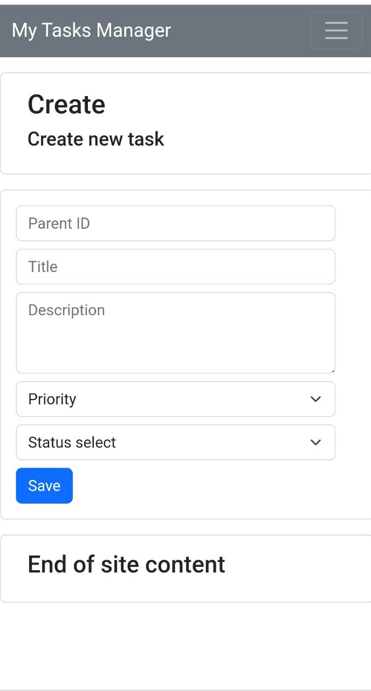
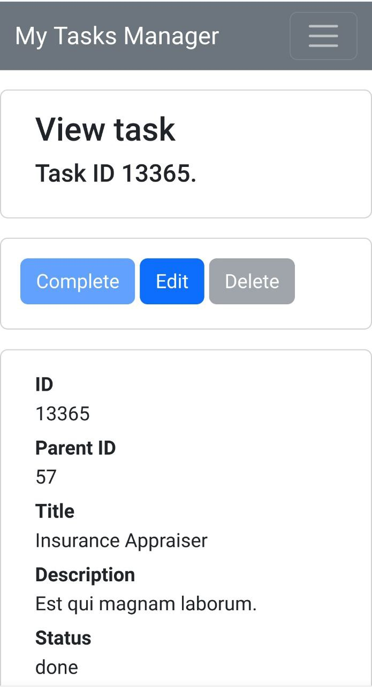
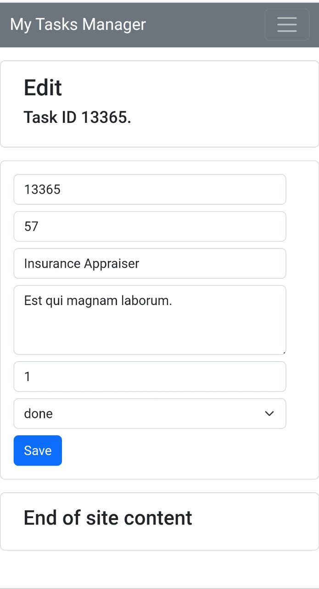
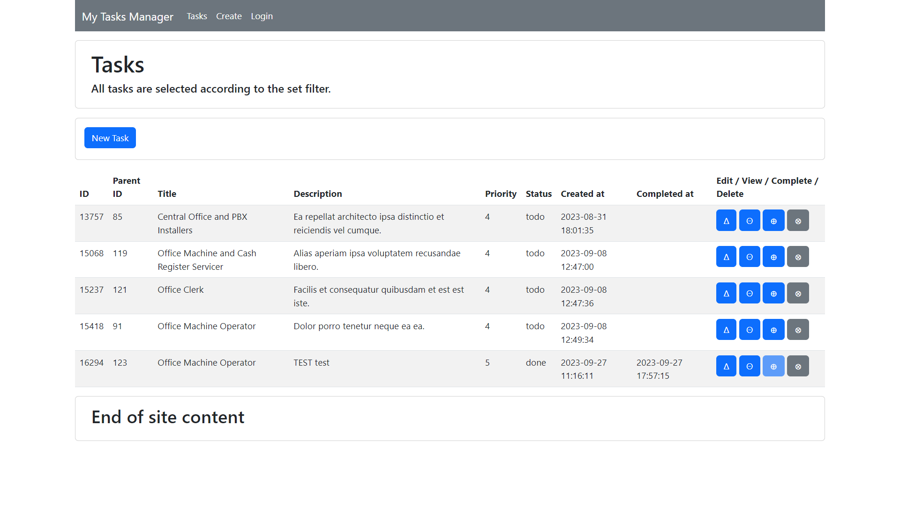
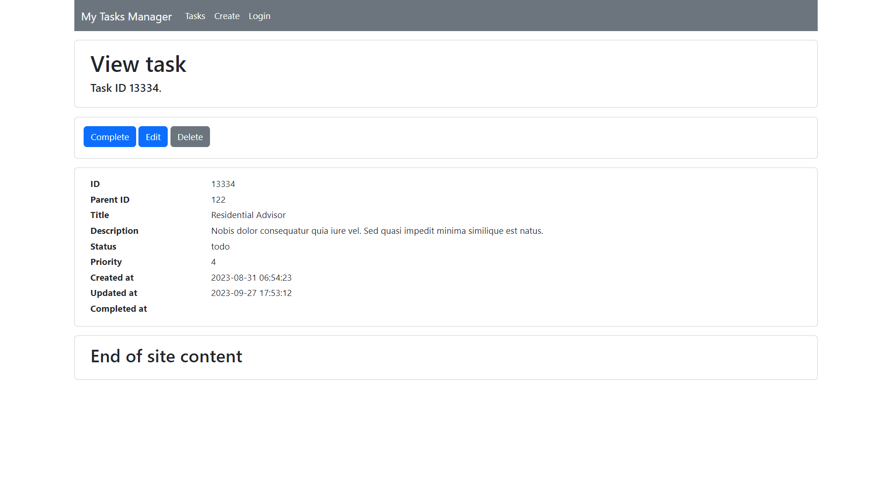
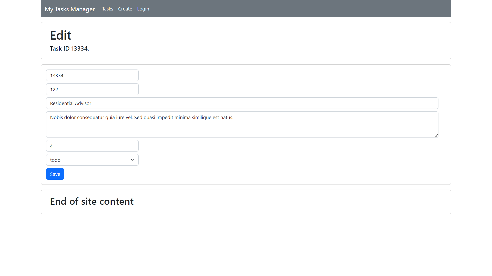

<p align="center"><a href="https://laravel.com" target="_blank"></a></p>

<p align="center">
<a href="https://github.com/laravel/framework/actions"></a>
<a href="https://packagist.org/packages/laravel/framework"></a>
<a href="https://packagist.org/packages/laravel/framework"></a>
<a href="https://packagist.org/packages/laravel/framework"></a>
</p>

## Laravel TODO List REST API / and WEB

#### Required version: `PHP 8.1 or later`

> <span style="color: red">Migration '...create_database_testing' will drop database 'testing' if it exists.
Make Backup Database 'testing', please!</span>

Implemented:

- Model "Task",
- Controller "\API\TaskShowController",
- Controller "\API\TaskIndexController",
- Controller "\API\TaskCompleteController",
- Controller "\API\TaskCreateController",
- Controller "\API\TaskUpdateController",
- Controller "\API\TaskDeleteController",
- Controller "\Web\TaskAddController.php"
- Controller "\Web\TaskCompleteController"
- Controller "\Web\TaskCreateController"
- Controller "\Web\TaskDeleteController"
- Controller "\Web\TaskEditController"
- Controller "\Web\TaskIndexController"
- Controller "\Web\TaskShowController"
- Controller "\Web\TaskUpdateController"
- Data validation rules "\Requests\Api\TaskRequest"
- Data validation rules "\Requests\Api\TaskOrderRequest"
- Data validation rules "\Requests\Api\TaskIndexRequest"
- Data validation rules "\Requests\Api\TaskUpdateRequest"
- Class return json response for all errors of requests validation "\Requests\Api\ApiFormRequest".
- TaskPathEnum file contains all system paths.
- English and Ukrainian localization files.
- Feature tests.
- Unit tests.
- Implemented boolean full-text searches using the IN BOOLEAN MODE modifier ('title' field).
- Request & Response DTO
- Enums & Services
- View blade patterns

Migration creates:

- table "tasks",
- row "api_token" into "users" table.
- table "testing.tasks" & "testing.users".

Recursive query for searching tasks children in code, unfortunately.
But in future the query must migrate to stored procedure.

Do not implement:

- Pagination
- Web user authentication
- Recursive delete tasks and children if parent task was deleted.

### Task searching filters and ordering expressions.

Fields for searching:

( Allowed sorting directions for GET request are set in OrderDirectionEnum, allowed 'up' and 'dw')

- status
    - GET query `&status=todo`
    - SQL query `status = 'todo'`
- priority
    - GET query `&priority=2`
    - SQL query `priority >= 2`
- title
    - GET query `&title=Title_of_task`
    - SQL query `(full text searching) MATCH (title) AGAINST ('Title_of_task')`

Fields for ordering:

- priority
    - GET query `&prioritySort=up`
    - SQL query `order by priority asc`
- created_at
    - GET query `&createdSort=dw`
    - SQL query `order by cteated_at desc`
- completed_at
    - GET query `&completedSort=dw`
    - SQL query `order by comlpeted_at desc`

Example GET query:

```
GET http://my_tasks_manager.com:80/tasks/?api_token=**********&status=todo&priority=2&createdSort=up&prioritySort=dw
```

Show request

```
HTTP/1.1 200 OK
Host: 127.0.0.1:80
Date: Sun, 13 Aug 2123 20:28:34 GMT
Connection: close
X-Powered-By: PHP/8.2.8
Cache-Control: no-cache, private
Date: Sun, 13 Aug 2123 20:28:34 GMT
Content-Type: application/json
X-RateLimit-Limit: 60
X-RateLimit-Remaining: 59
Access-Control-Allow-Origin: *

{
    "status": 200,
    "message": "All tasks",
    "data": [
        {
            "id": 375,
            "parent_id": 21,
            "user_id": 857,
            "status": "todo",
            "priority": 2,
            "title": "Test Task",
            "description": "Neque porro quisquam est qui dolorem ipsum quia dolor sit amet, consectetur, adipisci velit...",
            "created_at": "2123-07-31T21:32:38.000000Z",
            "updated_at": "2123-08-12T08:45:59.000000Z",
            "completed_at": null
        },
        {
            "id": 1431,
            "parent_id": 17,
            "user_id": 857,
            "status": "todo",
            "priority": 2,
            "title": "New Task",
            "description": "Nam quam nunc, blandit vel, luctus pulvinar, hendrerit id, lorem. Maecenas nec odio et ante tincidunt tempus.",
            "created_at": "2123-08-13T19:38:39.000000Z",
            "updated_at": "2123-09-15T20:06:17.000000Z",
            "completed_at": null
        }
    ]
}
```

### Show one task only

Example GET query show task id=869:

```
GET http://my_tasks_manager.com:80/api/tasks/show/869?api_token=**********
```

Show request

```
HTTP/1.1 200 OK
Host: 127.0.0.1:80
Date: Sun, 13 Aug 2123 15:48:42 GMT
Connection: close
X-Powered-By: PHP/8.2.8
Cache-Control: no-cache, private
Date: Sun, 13 Aug 2123 15:48:42 GMT
Content-Type: application/json
X-RateLimit-Limit: 60
X-RateLimit-Remaining: 59
Access-Control-Allow-Origin: *

{
    "status": 200,
    "message": "Task ID 869.",
    "data": {
        "id": 869,
        "parent_id": 37,
        "user_id": 418,
        "status": "done",
        "priority": 3,
        "title": "Old Task",
        "description": " Sed fringilla mauris sit amet nibh. Donec sodales sagittis magna.",
        "created_at": "2123-08-11T11:38:39.000000Z",
        "updated_at": "2123-08-12T20:06:17.000000Z",
        "completed_at": "2123-08-12T20:06:17.000000Z"
    }
}
```

### The status of the task is set to "done".

Example PUT query sets status to 'done' task id=869:

```
PUT http://my_tasks_manager.com:80/api/tasks/complete/869?api_token=**********
```

Show request (all children have status 'todo')

```
HTTP/1.1 200 OK
Host: 127.0.0.1:80
Date: Sun, 13 Aug 2123 11:04:63 GMT
Connection: close
X-Powered-By: PHP/8.2.8
Cache-Control: no-cache, private
Date: Sun, 13 Aug 2123 11:04:63 GMT
Content-Type: application/json
X-RateLimit-Limit: 60
X-RateLimit-Remaining: 59
Access-Control-Allow-Origin: *

{
    "status": 200,
    "message": "Task ID 869 was marked 'done' successfully",
    "data": true
}
```

Show request (children have status 'done')

```
HTTP/1.1 200 OK
Host: 127.0.0.1:80
Date: Sun, 13 Aug 2123 11:04:63 GMT
Connection: close
X-Powered-By: PHP/8.2.8
Cache-Control: no-cache, private
Date: Sun, 13 Aug 2123 11:04:63 GMT
Content-Type: application/json
X-RateLimit-Limit: 60
X-RateLimit-Remaining: 59
Access-Control-Allow-Origin: *

{
    "status": 200,
    "message": "One or more children of Task ID 1 have status 'done'.",
    "data": false
}
```

### Delete Task

Example DELETE Query, delete task id=883:

```
DELETE http://my_tasks_manager.com:80/api/tasks/delete/883?api_token=**********
```

Show request (Task status is 'todo')

```
HTTP/1.1 200 OK
Host: 127.0.0.1:80
Date: Sun, 13 Aug 2123 15:48:42 GMT
Connection: close
X-Powered-By: PHP/8.2.8
Cache-Control: no-cache, private
Date: Sun, 13 Aug 2123 15:48:42 GMT
Content-Type: application/json
X-RateLimit-Limit: 60
X-RateLimit-Remaining: 59
Access-Control-Allow-Origin: *

{
    "status": 200,
    "message": "Task ID 883 was deleted successfully.",
    "data": true
}
```

Show request (Task status is 'done')

```
HTTP/1.1 200 OK
Host: 127.0.0.1:80
Date: Sun, 13 Aug 2123 16:48:42 GMT
Connection: close
X-Powered-By: PHP/8.2.8
Cache-Control: no-cache, private
Date: Sun, 13 Aug 2123 16:48:42 GMT
Content-Type: application/json
X-RateLimit-Limit: 60
X-RateLimit-Remaining: 59
Access-Control-Allow-Origin: *

{
    "status": 200,
    "message": "Task ID 883 status: 'done'. Please select another task.",
    "data": {
        "id": 883,
        "parent_id": 37,
        "user_id": 418,
        "status": "done",
        "priority": 3,
        "title": "Old Task",
        "description": " Sed fringilla mauris sit amet nibh. Donec sodales sagittis magna.",
        "created_at": "2123-08-13T11:38:39.000000Z",
        "updated_at": "2123-08-15T20:06:17.000000Z",
        "completed_at": "2123-08-15T20:06:17.000000Z"
    }
}
```

### Update Task

Example Update query:

```
PUT http://my_tasks_manager.com:80/api/tasks/update/?api_token=**********&id=391&description=Start_new_project
```

Show request

```
HTTP/1.1 200 OK
Host: 127.0.0.1:80
Date: Sun, 13 Aug 2123 12:00:10 GMT
Connection: close
X-Powered-By: PHP/8.2.8
Cache-Control: no-cache, private
Date: Sun, 13 Aug 2123 12:00:10 GMT
Content-Type: application/json
X-RateLimit-Limit: 60
X-RateLimit-Remaining: 59
Access-Control-Allow-Origin: *

{
    "status": 200,
    "message": "Task was updated successfully.",
    "data": {
        "id": 391,
        "parent_id": 47,
        "user_id": 179,
        "status": "done",
        "priority": 1,
        "title": "New_project",
        "description": "Start_new_project",
        "created_at": "2123-08-12T18:45:09.000000Z",
        "updated_at": "2123-08-15T19:21:26.000000Z",
        "completed_at": "2123-08-15T19:21:26.000000Z"
    }
}
```

===============

add branch dev

===============

##### Examples of web pages









If you find any errors, please email admin@autodoctor.od.ua
